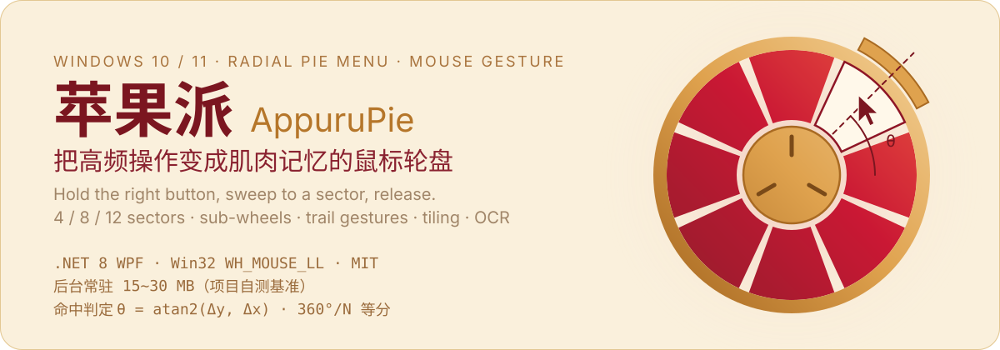
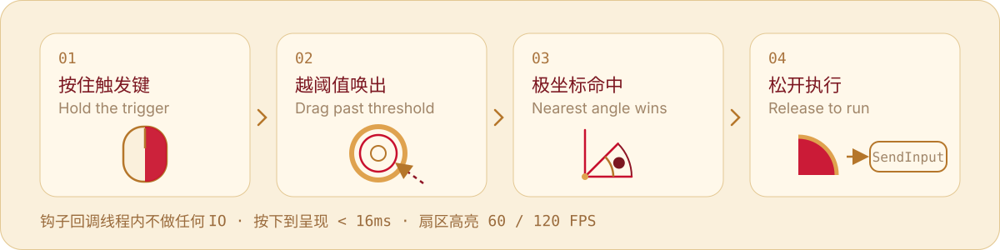

<a id="top"></a>
<p align="center">
  
</p>

<p align="center">
  <a href="https://github.com/SoftBlack42/StarPie/releases"></a>
  <a href="https://github.com/SoftBlack42/StarPie/releases"></a>
  
  
  
  <a href="#build"></a>
  <a href="plugin/README.md"></a>
</p>

<p align="center">
  <a href="README.md"></a>
  <a href="README_EN.md"></a>
</p>

<p align="center">
  <a href="#proof">🎬 Live Demo</a> •
  <a href="#mechanism">⚙️ How it works</a> •
  <a href="#download">🚀 Download</a> •
  <a href="#features">✨ Features</a> •
  <a href="#plugin">🧩 Plugins</a> •
  <a href="#i18n">🌐 i18n</a> •
  <a href="#build">🛠️ Build</a> •
  <a href="#acknowledgements">💡 Story</a> •
  <a href="CHANGELOG.md">📋 Changelog</a>
</p>

---

## <a id="proof"></a>🎬 实机演示 / Proof

A gesture wheel only makes sense once you feel it. The two clips below are unedited recordings: on the left, "hold the right button → sweep → release to trigger"; on the right, the same geometry rendered live across themes and shapes.

<p align="center">
  
  
</p>

<details open>
<summary><b>📺 完整讲解视频 / Narrated walkthrough (Bilibili)</b></summary>
<br/>
<p align="center">
  <a href="https://www.bilibili.com/video/BV1XjtA6KEGL" target="_blank">
    
  </a>
  <br/>
  <a href="https://www.bilibili.com/video/BV1cubL6WEpB"></a>
</p>
</details>

---

## <a id="intro"></a>📖 它是什么 / What it is

**AppuruPie (苹果派)** is a lightweight radial mouse-gesture (Radial / Pie Menu) productivity tool built for Windows 10 / 11. Hold the **right / middle / side mouse button or a keyboard trigger key** and a wheel appears under the cursor; slide onto a sector, release, and the action runs. Trail gestures — drawing a direction combo without summoning the wheel — are supported as well.

The problem it removes: **a high-frequency action should not have to be hunted through a menu every time.** Bind "Undo", "switch window", "launch an app", "tile", "snip & OCR" to fixed spatial directions and, after a few dozen uses, it becomes blind operation that costs zero thought.

Three engineering red lines — they decide every trade-off in this project:

- ⚡ **Zero latency**: summoning from button-press to rendered scene is **< 16ms**; the hook callback never performs IO or heavy work, only lightweight bit operations;
- 🪶 **Ultra-lightweight**: native C# WPF + Win32 P/Invoke, no Electron / MAUI / bundled browser engine; brushes and animations are explicitly `Freezable.Freeze()`-d;
- 🎯 **Muscle memory & determinism**: sectors are strictly bound to polar directions (4 / 8 / 12 presets, each 360°/N and **sector 0 fixed due east**), which rules out misfires and drift.

---

## <a id="mechanism"></a>⚙️ 工作原理 / How it works

<p align="center">
  
</p>

A single sweep passes through three stages, each guarding one red line:

| Stage | Implementation | Why it is cut this way |
| :--- | :--- | :--- |
| **Capture** | `MouseHook.cs` (`WH_MOUSE_LL` on a dedicated thread) | The callback only does bit math and timestamps — any IO there shows up as a dropped frame |
| **Resolve** | `GestureController.cs` (polar state machine) | Hit-testing uses **nearest angular distance**, not Euclidean distance, so direction is the verdict and left/right can never swap |
| **Execute** | `ActionExecutor.cs` + `SendInput` | Scan codes plus a modifier-hold delay, so the target app does not read `Ctrl + G` as a bare `G` |

### Typical physical working set (project-measured baseline)

| Runtime state | Physical working set |
| :--- | :---: |
| 🌙 Silent background daemon (tray + global hooks only) | **15 ~ 30 MB** (about 10 ~ 20 MB after the system compacts it in sleep) |
| 🎡 Wheel summon & gesture interaction (hardware-accelerated transparent rendering) | **25 ~ 50 MB** peak |
| 🖥️ Full console UI (4 tabs + live canvas) | **60 ~ 110 MB**, released 30 s after the window closes |

> These numbers are this project's own measurements of the real runtime working set, not theoretical estimates. The console follows a "release 30 seconds after closing" policy so hot code stays in physical RAM and the next summon takes no hard page faults.

---

## <a id="download"></a>🚀 下载与上手 / Quick Start

**Latest stable `v1.7.4` (2026-09-19)** · **Development line `v1.8.0-beta.5`** (plugin system & SDK 1.8)

| Package | Recommended for | Description | Download |
| :--- | :--- | :--- | :--- |
| **Standalone single-file (recommended)** | Everyone | .NET runtime embedded; unzip and run | [⬇️ StarPie.exe (Standalone)](https://github.com/SoftBlack42/StarPie/releases) |
| **Lightweight portable** | Users with the .NET 8 runtime installed | Small footprint, portable | [⬇️ StarPie Portable](https://github.com/SoftBlack42/StarPie/releases) |
| **Historical releases** | Rollback & comparison | Binaries and notes of previous versions | [📂 Browse the Releases archive](https://github.com/SoftBlack42/StarPie/releases) |

> ℹ️ **Naming and where the binaries come from**: this project is **AppuruPie (苹果派)**, but the Windows artifacts, the executable name `StarPie.exe`, the data directory `%LOCALAPPDATA%\StarPie\` and the contract assembly `StarPie.Plugin.Abstractions` still carry the upstream naming, and this repository publishes no Releases of its own — so the download and clone links point at `SoftBlack42/StarPie`.

### Your first successful sweep

1. Download and run `StarPie.exe` — it keeps running quietly in the system tray;
2. Double-click the tray icon, or right-click and choose "Preferences", then record the wheel trigger key under "Triggers & Scenes";
3. Hold the trigger key and drag past the threshold (or long-press, per your configuration) to summon the wheel near the cursor;
4. Slide onto the target sector and release to execute; flick outward to cancel, or to run your own cancel action;
5. For trail gestures, enable a dedicated gesture trigger key and map 1–3 segment direction combos on the Actions page.

---

## <a id="features"></a>✨ 功能特性 / Features

What the current build covers:

| Area | Current capabilities |
| :--- | :--- |
| **Wheel interaction** | 4 / 8 / 12 sectors, center-core actions, multi-level sub-wheels, honeycomb fans & outer-escape cancel |
| **Trail gestures** | Up to 3 segments, 8-direction combinations, trail overlay, per-segment sensitivity & release hints |
| **Actions & windows** | Hotkeys, apps, URLs, folders, commands, system controls, plus window switching, tiling, cross-monitor moves, always-on-top & transparency |
| **Screen OCR** | Local offline Windows recognition, AI vision APIs & custom HTTP OCR |
| **Instant finder** | Self-contained native search with no external dependency; apps and system tools short-circuit in milliseconds, deep recursion is capped by a 50ms time budget |
| **Configuration UX** | Two-pane focused editing, live wheel canvas, sector drag-to-swap, running-window capture & compact overview list |
| **Visual customization** | Multiple wheel shapes, independent level-1 / level-2 themes, per-sector font / icon / text-position overrides, screen-edge overflow protection & custom interaction sounds |
| **Plugin ecosystem** | In-process .NET DLL plugins, capability gates, declarative parameter forms, collectible-ALC unloading and end-to-end self-test (development line) |

> The demo GIFs below are collapsed by default — click **🎬 Show demo** to expand.

### 🎯 轮盘与手势 / Wheel & Gestures

#### 1. ⚡ Quick Gesture Summon & Action Trigger

- Hold and drag the right mouse button past the configured threshold to summon the wheel; slide onto a target sector and release to trigger its action (hotkey, app launch, folder, or system function);
- A normal right-click still opens the native context menu — the two never conflict;
- Supports right / middle / side buttons, single keyboard keys, and modifier combos as trigger keys, with either drag-past-threshold or long-press-delay summoning;
- While recording hotkeys, the app can temporarily take exclusive control and pause global hotkeys, preventing system combos like `Win + D` or `Alt + Tab` from firing accidentally.

<details>
<summary><b>🎬 Show demo</b></summary>
<br/>
<p align="center">
  
</p>
</details>

#### 2. 🌟 Multi-Level Cascading Sub-Wheels

- **Multi-level cascade interaction**: freely expand 1–4 secondary sub-actions in any sector. When the cursor dwells inside a sector, the outer ring smoothly unfolds secondary sub-sectors with a spring animation; slide outward to trigger at full speed;
- **Fully independent level-1 / level-2 themes & colors**: size, font size, and icon layout can be tuned per level; the secondary wheel can either **sync with the primary wheel in one click** or be **styled with a completely independent look & palette**;
- Two secondary forms are available — the outer sub-ring and the honeycomb fan — with hysteresis hold and debounce logic to reduce flicker and accidental collapse during boundary movements;
- Both level-1 and level-2 actions support drag-to-swap, with an option to swap a primary action's secondary sub-actions along with it.

<details>
<summary><b>🎬 Show demo</b></summary>
<br/>
<p align="center">
  
  
</p>
</details>

#### 3. 🚀 Outer Escape Cancel

- If you change your mind after drawing a gesture, there is no need to drag back to the center core;
- Simply flick outward past the wheel boundary — the wheel enters a translucent safe-cancel state, and releasing the button triggers nothing;
- It can be toggled in settings and fine-tuned with a distance slider (140px ~ 320px); since `v1.6.5`, the outer-escape cancel can also be bound to its own action with common presets, while the center-core cancel can stay silent.

<details>
<summary><b>🎬 Show demo</b></summary>
<br/>
<p align="center">
  
</p>
</details>

#### 4. 🎯 Adaptive 4 / 8 / 12 Sector Layouts

- **4 sectors**: wide cardinal angles, ideal for blind operation;
- **8 sectors**: the classic balanced 8-direction layout (default);
- **12 sectors**: high-density action mapping for multi-action workflows; the center core can also hold its own independent action, with a configurable activation dead-zone sensitivity.

<details>
<summary><b>🎬 Show demo</b></summary>
<br/>
<p align="center">
  
</p>
</details>

#### 5. ➡️ Independent Trail Gestures & Visual Hints

- A dedicated right, middle, or side button can be assigned to trail gestures, running in parallel with the wheel trigger key;
- Supports up to 3 segments and 8 directions, with short-segment filtering and adjacent same-direction merging to reduce micro-jitter misjudgment during fast drawing;
- A transparent trail overlay with start-point and release hints is displayed while drawing; segment sensitivity and hint text placement are adjustable;
- Light clicks below the drag threshold are replayed as native mouse clicks, leaving everyday operation untouched.

---

### 🎨 外观与配色 / Look & Feel

#### <a id="visuals"></a>6. 🎨 Multiple Wheel Shapes & Style Presets

- **4 geometric shapes**: Classic Compact Sectors (Original), Floating Circle (Circle), Rounded Capsule (Capsule), and Hexagon Hive;
- **Preset themes**: System Auto, Light, Dark, Liquid Glass, Matcha Forest, Glacial Blue, and Morandi Muted;
- The **live interactive preview canvas** on the right supports zoom, pan, reset, click-to-select, and drag-to-swap with instant feedback; `v1.6.8` adds a screen-edge overflow-protection strategy with X / Y safety margins.

<details>
<summary><b>🎬 Show demo</b></summary>
<br/>
<p align="center">
  
  
</p>
</details>

#### 7. 🎨 Advanced Color Tuning & Preset Renaming

- An independent collapsible panel for fine-tuning sector background, highlight glow, borders, and text colors;
- Supports hexadecimal color input, palette selection, and on-screen eyedropper;
- Save the current colors as custom presets, with one-click renaming and deletion.

<details>
<summary><b>🎬 Show demo</b></summary>
<br/>
<p align="center">
  
  
  <br/><br/>
  
</p>
</details>

#### 8. 🖼️ Custom Vector / Image Icon Import

- The icon library accepts local **SVG vector files** as well as **PNG / ICO / JPG** images;
- Imported icons are stored in the local configuration directory, can be freely used in any sector, and support custom renaming and deletion.

<details>
<summary><b>🎬 Show demo</b></summary>
<br/>
<p align="center">
  
</p>
</details>

---

### 🧰 动作与窗口 / Actions & Windows

#### 9. 🧰 A More Complete Action Type System

| Action category | Main use |
| :--- | :--- |
| **Hotkeys** | Record or assemble key combos, with primary-key search, Pause / Break support, and exclusive capture |
| **Launch App** | Start EXEs, shortcuts, or files, with arguments and a normal-privilege launch option |
| **Open URL** | Open with the system default, Chrome, Edge, Firefox, or a custom browser |
| **Open Folder** | Open local paths plus virtual directories like Desktop and Downloads |
| **Run Command** | CMD, PowerShell, WSL, and hidden terminal modes |
| **Screen OCR** | Snip a screen region and call local, AI, or custom HTTP recognition |
| **Window Management** | Switch windows, tile, move across monitors, always-on-top, and transparency control |
| **System Control** | Lock screen, volume, media, Task View, virtual desktops, and other system functions |

Action execution and display icons are fully decoupled — the same action can independently choose a built-in vector icon, the program's icon, or a custom image, no longer constrained by the action type.

#### 10. 🪟 Window Switching, Management & Tiling Layouts

- **Switch taskbar windows**: bind the Nth running window by the current taskbar order, with icon, title, and activation target all using the same snapshot;
- **Window tiling**: built-in layouts including Left/Right, Top/Bottom, Master-Stack, Grid, Single Window, Horizontal Stack, Vertical Stack, Columns, BSP, and Auto Grid;
- Supports cycling layouts forward / backward, restoring pre-tiling positions, including minimized windows, and a custom process exclusion list;
- Move the currently active window to the next monitor, toggle always-on-top, or adjust window transparency.

<details>
<summary><b>🎬 Show demo</b></summary>
<br/>
<p align="center">
  
</p>
</details>

#### 11. 📝 Native Windows OCR & Extensible Recognition Interfaces

- Snip any screen region and run text recognition, powered by the native offline `Windows.Media.Ocr` engine on Windows 10 / 11;
- Optional AI vision APIs or custom HTTP OCR services, with language-pack environment diagnostics and a configuration panel;
- Recognition results support auto-copy, a result window, merged lines, CJK spacing handling, and browser search.

<details>
<summary><b>🎬 Show demo</b></summary>
<br/>
<p align="center">
  
  
</p>
</details>

#### 12. 🔄 Online Updates, Diagnostic Logs & Contributor Info

- Built-in GitHub Releases update checking with selectable update channels, proxy mirrors, custom proxies, and ignored versions;
- System logs are written asynchronously via a background queue; the log directory and today's log can be opened quickly from settings;
- The contributor card uses an offline roster by default and never connects on startup, only requesting fresh data on manual refresh or update checks.

<details>
<summary><b>🎬 Show demo</b></summary>
<br/>
<p align="center">
  
</p>
</details>

---

### 🛡️ 方案与场景 / Profiles & Scenes

#### 13. 💼 Per-App Profiles

- Assign dedicated wheel profiles to different foreground apps such as Chrome, VS Code, Photoshop, or SolidWorks;
- AppuruPie automatically matches the profile of the currently active app and falls back to the global profile when no dedicated one exists;
- Since `v1.7.4`, "inherit unconfigured slots from the global profile" defaults to **off**, so an app profile has a fully independent configuration space; turn it on per profile when you do want a global fallback;
- Profiles can be created, duplicated, deleted, and renamed in one click, making it easy to reuse and maintain different workflows.

<details>
<summary><b>🎬 Show demo</b></summary>
<br/>
<p align="center">
  
</p>
</details>

#### 14. 🎛️ Action Configuration Workspace, Quick App Capture & Drag-to-Edit

- The Actions page adopts a two-pane workspace — "profile + focused editing card + live wheel canvas" — while keeping a compact overview list for scanning multiple actions at a glance;
- A smart app selector aggregates installed programs and supports name search and quick filtering;
- A running-window capture tool lets you pick a window or process directly from the current desktop, reducing manual hunting for executable paths;
- Click the canvas to select a target sector, and drag to swap primary sectors, secondary actions, and the center core;
- The center core can enable its own action, with dead-zone release triggering, common presets, and independent text & icon layout;
- Every sector can independently override layout mode, font, font size, text color, icon size, text position, and X / Y offsets.

<details>
<summary><b>🎬 Show demo</b></summary>
<br/>
<p align="center">
  
  
</p>
</details>

#### 15. 🛡️ Scene Isolation, Fullscreen Safety & Multilingual

- **Fullscreen & game detection**: the native right-click is automatically released while fullscreen-exclusive apps or games are running;
- **Modifier passthrough**: bypass the wheel while holding Ctrl / Shift / Alt;
- **Blacklist support**: add specific processes to the exclusion list;
- **Hot language switching**: built-in Simplified Chinese, Traditional Chinese, English, and Japanese, effective instantly; `ScreenHelper` unifies multi-monitor, mixed-DPI, and screen-edge coordinate handling to reduce summoning drift and wheel overflow on secondary displays.

<details>
<summary><b>🎬 Show demo</b></summary>
<br/>
<p align="center">
  
  
</p>
</details>

---

## <a id="plugin"></a>🧩 插件系统 / Plugin System

AppuruPie uses a lightweight **in-process .NET DLL plugin architecture**. A plugin only references the standalone
`StarPie.Plugin.Abstractions` contract assembly and registers its contributions during `Initialize`; the host wraps
every plugin in its own instance object and manages scanning, loading, lazy activation, invocation leases, exception
isolation, asynchronous deactivation, and assembly unloading.

The action-execution path already closes the loop from registration and configuration through parameter validation to
Sequential / Background scheduling; the interaction-event and wheel-structure paths have extensible entry points too, so
they can grow without duplicating the plugin lifecycle code.

> 📖 **Plugin development entry point**: documentation, the current API, architecture notes, samples, and historical material live in [AppuruPie Plugin Resources](plugin/README.md).
> 🔗 **Official plugin repository**: [StarPie-Official-Plugins](https://github.com/Star-Pie/StarPie-Official-Plugins). `plugin/StarPie-Official-Plugins/` in this repository is the Git submodule checkout of that repository; official plugin sources, packaging, and releases are maintained there, and this repository never references, builds, or ships official plugin DLLs.

- **Official modules: manual install plus a one-time informed-consent bootstrap (1.8.0+)**:
  - **Nothing preset in the release package**: AppuruPie ships without official plugin DLLs, and startup and background running keep zero automatic network requests.
  - **One-time bootstrap consent**: to shorten the path to first use, 1.8.0+ shows a single one-time consent dialog the first time the user interactively opens the settings window (not on silent start, not in self-test mode, and only when the plugin system is enabled and healthy). The dialog lists the 5 core official plugins (`folder`, `weburl`, `launch`, `system`, `shelltool`), the official repository source, and the required capabilities (`Process`, `InputSimulation`).
  - **Zero network requests before consent**: before the user clicks "Install all", the host performs no network request at all (no catalog fetch, no download). After consent it installs only the missing items; already-installed items are skipped (never overwritten, never upgraded, and their disabled state is preserved); if the official catalog introduces capabilities beyond the announced set, it pauses and asks the user to confirm.
  - **Persistent retry banner**: if the user chooses "Not now" or some downloads fail, a lightweight retry/install banner stays at the top of the "Plugins & Extensions" page; successful items are kept and the missing ones can be completed at any time.
- **Community plugins remain locally installable**: drop a community plugin `.dll` into the **`plugin` folder next to the executable** and hit "Rescan", then click Install on the candidate card; or pick it via "Install Community Plugin (.dll)" in settings.
- **⚠️ A `.dll` in `plugin\` brings only itself**: other files in the plugin package (icons, resources,
  dependency DLLs) are *not* copied along. For a **full-package install**, use "Install Community Plugin (.dll)" and select
  the `.dll` that sits next to a `plugin.json` — once the manifest is detected the host copies the whole folder.
- **Two directories with separate responsibilities**:

  | Directory | Role |
  | :--- | :--- |
  | `<install dir>\plugin\` | **Community-plugin candidate area**: used only for manual community `.dll` installation. AppuruPie **never creates, writes or deletes** anything here |
  | `%LOCALAPPDATA%\StarPie\plugin-data\` | **Writable data area**: installed copies, enable state and per-plugin data. Fully removed on uninstall |

- **Install and enable are separate steps**: a freshly installed plugin stays "installed but disabled" until you
  tick it. This keeps "copying a file in" from being equivalent to "letting its code run". The confirmation card
  shows the ID, version, author, target framework, architecture, SHA256, signature status and declared capabilities.
- **Candidate cards state their conclusion outright**: installable / newer version / older version / already
  installed / content changed / duplicate ID / unrecognised. If two files declare the same ID, both are flagged as
  duplicates and neither can be installed.
- **Fail-safe by default**: a single plugin that fails to load or keeps throwing is isolated and never affects the
  AppuruPie host; two consecutive abnormal startups switch on safe mode and temporarily disable the suspect plugins.
- **For plugin authors**: `plugin/samples/` contains three projects you can copy directly — `HelloAction` as the
  reference template, `ScreenBrightness` covering P/Invoke, COM and slow I/O, and `FloatingBall` as the resident-window
  form (the plugin draws its own ball and summons the user-configured host wheel through `IHostWheelService`, while its
  appearance parameters demonstrate both action parameters and a plugin-level settings page). For debugging, run
  `StarPie.exe --plugin-selftest <plugin.dll> [report path] [--skip-invoke]` to exercise the whole chain inside a
  temporary sandbox without touching your installed plugins, or `StarPie.exe --plugin-paths` to inspect the
  effective directories.

---

## <a id="i18n"></a>🌐 多语言支持 / Internationalization

Switch the interface language anytime under "⚙️ Advanced & System" — effective instantly:

| Code | Display name | Status |
| :--- | :--- | :---: |
| `zh-CN` | 🇨🇳 简体中文 (Simplified Chinese) | 🟢 Fully supported |
| `zh-TW` | 🇭🇰/🇹🇼 繁體中文 (Traditional Chinese) | 🟢 Fully supported |
| `en` | 🇺 English | 🟢 Fully supported |
| `ja` | 🇯🇵 日本語 (Japanese) | 🟢 Fully supported |
| `Auto` | 🖥️ Follow OS language | 🟢 Fully supported |

---

## <a id="build"></a>🛠️ 本地构建与开发 / Build & Development

**Requirements**: Windows 10 / 11 (x64) · [.NET 8.0 SDK](https://dotnet.microsoft.com/download/dotnet/8.0) · Python 3.10+ (only to run the automated test suite)

```bash
# 1. Clone the repository
git clone https://github.com/SoftBlack42/StarPie.git
cd StarPie

# 2. Build the project (Release)
dotnet build WinPieGestures/WinPieGestures.csproj -c Release

# 3. Run the project
dotnet run --project WinPieGestures/WinPieGestures.csproj

# 4. Publish the lightweight build (requires .NET 8 Desktop Runtime on the target machine)
dotnet publish WinPieGestures/WinPieGestures.csproj -c Release -r win-x64 --no-self-contained -o releases/local/Lightweight

# 5. Publish the standalone build (self-contained with the .NET runtime)
dotnet publish WinPieGestures/WinPieGestures.csproj -c Release -r win-x64 --self-contained true -p:PublishSingleFile=true -p:IncludeNativeLibrariesForSelfExtract=true -o releases/local/Standalone
```

**Automated tests**: a pywinauto + UIA GUI regression suite. **It opens real windows and needs a Windows desktop session** — 27 cases across three suites (settings window / plugin page / i18n ledger):

```bash
pip install pytest pywinauto
python -m pytest tests/ -v
```

---

## <a id="structure"></a>📂 项目结构 / Project Structure

<details>
<summary><b>Expand the full tree</b></summary>

```text
StarPie/
├── .github/                         # CI workflows & community configs
├── WinPieGestures/                  # Core project (C# / .NET 8 / WPF)
│   ├── ActionExecutor.cs            # Hotkey, app, URL, command & system action dispatching
│   ├── ActionItem.cs                # Action model & per-sector layout overrides
│   ├── MouseHook.cs                 # Win32 low-level mouse hook thread
│   ├── KeyboardHook.cs              # Win32 low-level keyboard hook & exclusive recording
│   ├── GestureController.cs         # Wheel & trail gesture state machine
│   ├── GestureMapping*.cs           # Trail combo mapping & configuration models
│   ├── GestureTrailOverlay.cs       # Trail rendering & release hint overlay
│   ├── RadialWindow.xaml(.cs)       # Transparent wheel window & runtime rendering
│   ├── SettingsWindow.xaml(.cs)     # Two-pane canvas, focused editing & system settings
│   ├── Plugin/                      # Plugin host (load context, scanning, registration, parameter forms, self-test)
│   ├── WindowTaskbarHelper.cs       # Taskbar order, window icons & switching snapshots
│   ├── WindowTiler.cs               # Window tiling, restore, cycling & cross-screen control
│   ├── WindowPickerWindow.xaml(.cs) # Active window & process capture tool
│   ├── ScreenHelper.cs              # Multi-monitor, DPI & screen-edge coordinates
│   ├── ScreenSnipWindow.xaml(.cs)   # OCR snipping region selection
│   ├── OcrManager.cs                # Local, AI & HTTP OCR dispatching
│   ├── OcrSettingsDialog.xaml(.cs)  # OCR engine & interface settings
│   ├── OcrResultWindow.xaml(.cs)    # OCR result display
│   ├── UpdateManager.cs             # GitHub Releases update checking
│   ├── AppLogger.cs                 # Asynchronous runtime logging
│   ├── ConfigManager.cs             # Config persistence, import/export & autostart
│   ├── IconHelper.cs                # Built-in / program / custom icon resolution
│   └── WinPieGestures.csproj        # .NET 8 WPF project configuration
├── plugin/                          # Plugin documentation, SDK, samples & the official-plugin submodule
├── releases/                        # Historical versions & release archive
├── installer/                       # Inno Setup installer scripts
├── assets/                          # Brand material (logo / app icon / README visual sources)
├── attachments/                     # README screenshots and GIF demo assets
├── tests/                           # pywinauto GUI automation tests
├── AGENTS.md                        # Architecture & multi-round development handover spec
├── CHANGELOG.md                     # Full version changelog
├── CONTRIBUTING.md                  # Contribution guide
├── LICENSE                          # MIT License
└── README_EN.md                     # English documentation (this file)
```

</details>

---

## <a id="acknowledgements"></a>💡 开发故事与维护说明 / Story & Maintenance

### 🌟 Inspiration

I am a student majoring in Mechanical Design, Manufacturing & Automation. In daily 3D modeling with SolidWorks, I always found its built-in mouse gesture radial menu extremely handy.

After getting to know AI-agent-assisted development tools, the idea came to me of bringing this radial interaction to the entire Windows desktop, hoping to make everyday office work and operation more convenient. For those who have never used a gesture wheel before, this may well be a novel and efficient interaction experience.

Although similar radial-menu projects already exist in the open-source community, each differs in feature focus and interaction details. From the initial idea to the release — interrupted from time to time by coursework and competitions — the current version took about a week of on-and-off collaboration with an AI Agent.

If anything in this project is imperfect or overlooked, thank you for your understanding. Bug reports, usage feedback, and improvement suggestions are always welcome via GitHub Issues!

### 🤖 Human-AI Collaborative Development

This project is led by the developer for architecture design, interaction logic planning, and system tuning, with code construction, multilingual support, interaction optimization, and GUI automation testing co-authored by an AI agent (**AI Agent - Antigravity**) and open-source contributors.

### 📌 Maintenance Notes

- **Current status**: as of 2026-10-03, the latest stable release is `v1.7.4` (2026-09-19) and `main` has advanced to `v1.8.0-beta.5` (plugin system & SDK 1.8); the wheel, trail gestures, window management, OCR, and configuration workflows are still being refined;
- **Ongoing cadence**: the project continues to be maintained through joint iteration by the developer, community contributors, and AI agents — feature suggestions, compatibility feedback, and demo assets are welcome via Issues / Pull Requests.

---

## <a id="license"></a>📄 开源许可证与使用须知 / License

This project is licensed under the [MIT License (with Non-Commercial Restriction)](LICENSE):

- **Personal & non-commercial use**: completely free for personal, educational, research, and non-commercial daily office workflows. Contributions, feature requests, and personal customizations are welcome.
- **Commercial restrictions**: without explicit prior written permission from the copyright owner (SoftBlack42), any commercial sale, paid repackaging/distribution on marketplaces, or embedding into proprietary closed-source commercial software is strictly prohibited. For commercial licensing, please contact the author.

---

<p align="center">
  <a href="#top"></a>
  <a href="https://github.com/SoftBlack42/StarPie/releases"></a>
</p>
